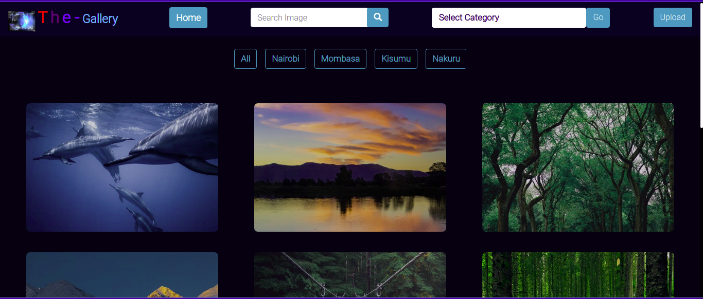
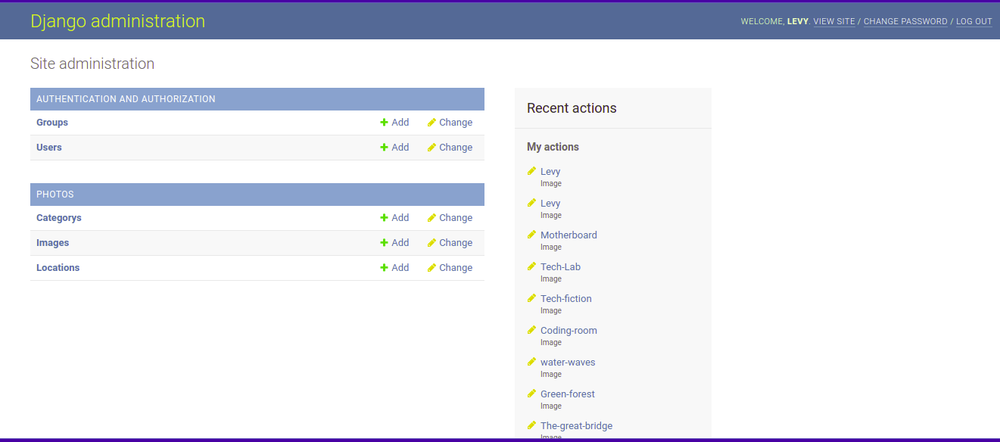

# The Gallery


# Description
The Gallery is a django web application where users can view different photos. They can filter the images by categories they belong to or by their location of capture. Allows users to copy the image lnk for other secondary uses.


## Previews

## Project live sites
  * This is the live [link to the repo ](https://github.com/omololevy/Gallery) <br>
  * This is the live [link to the app ](https://levygallery.herokuapp.com/)


## Homepage Demo
The app looks like this: 
  

## Admin Dashboard
The admin dashboard for managing posted images looks like this: 
  
  
## Author
[Levy Omolo](https://github.com/omololevy/)
## User Story
With this application, users are able to :
1. View different photos that interest them
2. Click a single image to expand it and view the details of that photo
3. Search for different categories
4. Copy a link to the photo to share with my friends.
5. View photos based on the location they were taken.


## Setup/Installation Requirements

### Database

1. Set up Database,and put your username and password in the code

2. Make migrations

    ```python3 manage.py makemigrations photos```

3. Migrate

   ```python3 manage.py migrate ```
    
### Running the Application
1. Run main apllication

   ```python3 manage.py runserver```

2. Run tests

    
   ``` python3 manage.py test photos```

## Technologies Used

* Python3
* Django 3.2
* Bootstrap
* PostgreSQL
* CSS
* Heroku

## Contact Information

For any further inquiries or contributions or comments, reach me at [Levy Omolo](https://github.com/omololevy)

### License

[MIT License](https://github.com/omololevy/Gallery/blob/main/license)

Copyright (c) 2021
